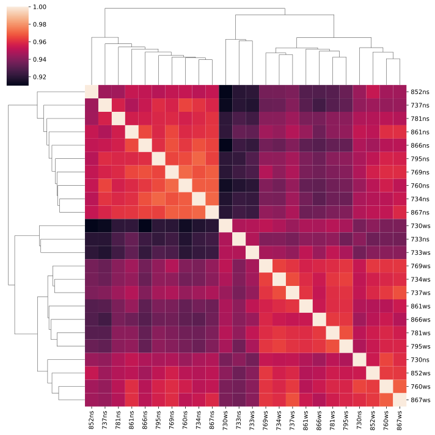
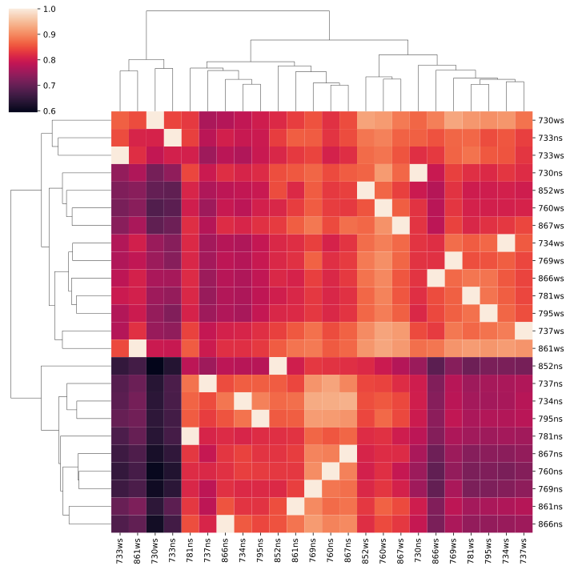
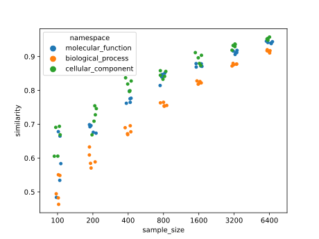

- Install environment: `conda env create --file environment.yaml`
- Activate environment: `conda activate snakemake`
- Run analysis: 
```
cd workflows/{analysis of choice}
snakemake --forceall --cores
```

# Results
csv-tables containing the similarities between all samples are in the `workflows/{comparison}/aggregated_sim` folder.

Conducted comparisons are:
- [megago based on real-world data](workflows/megago_comparison/)
- [string based comparison on real-world data](workflows/string_based_comparison/)
- [megago based on random sets of go terms of various sizes](workflows/random_gos_comparison/)

## real world results
Input data is from [here](https://zenodo.org/record/2652530)

### using megago

- [biological process plot](workflows/megago_comparison/figures/similarity_bp.svg)
- [cellular component plot](workflows/megago_comparison/figures/similarity_cc.svg)

### using string based comparison
according to methods in preprint of [metaproteomics tool survey](https://doi.org/10.1101/2020.01.07.897561)


- [biological process plot](workflows/string_based_comparison/figures/similarity_bp.svg)
- [cellular component plot](workflows/string_based_comparison/figures/similarity_cc.svg)


## random set comparison
GO-terms are sampled from SwissProt to resemble real-world data. Two sets of equal size are drawn n times, repeated for 
different sample sizes.
