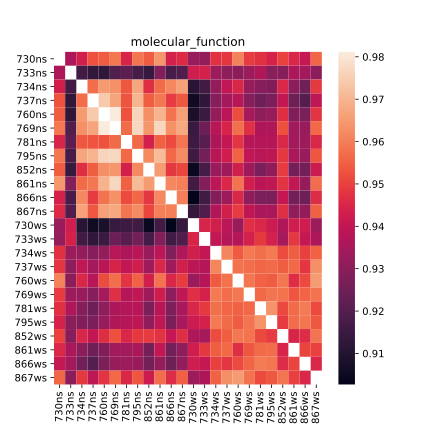
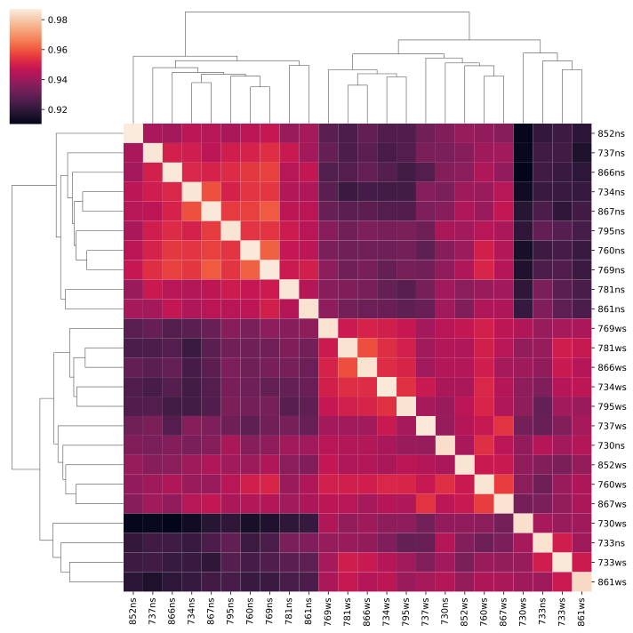
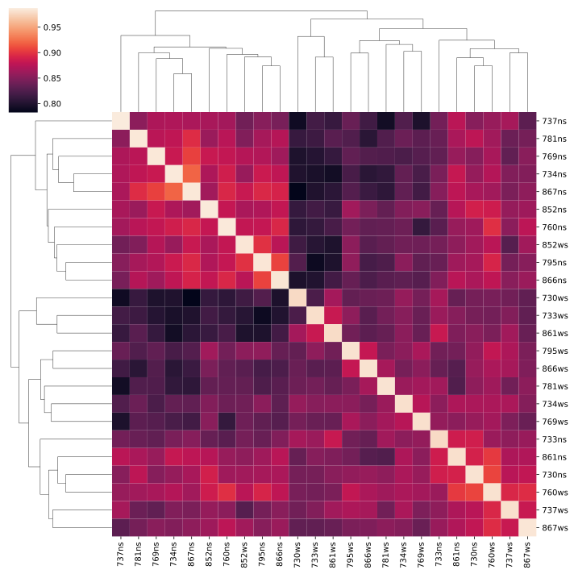

Input data is from [here](https://zenodo.org/record/2652530)

Install environment: `conda env create --file environment.yaml`
Activate environment: `conda activate snakemake`
Run analysis: `snakemake --forceall --cores`

# Results
csv-tables containing the similarities between all samples are in the [aggregated_sim](aggregated_sim) folder.

## molecular function

## biological process

## cellular component

