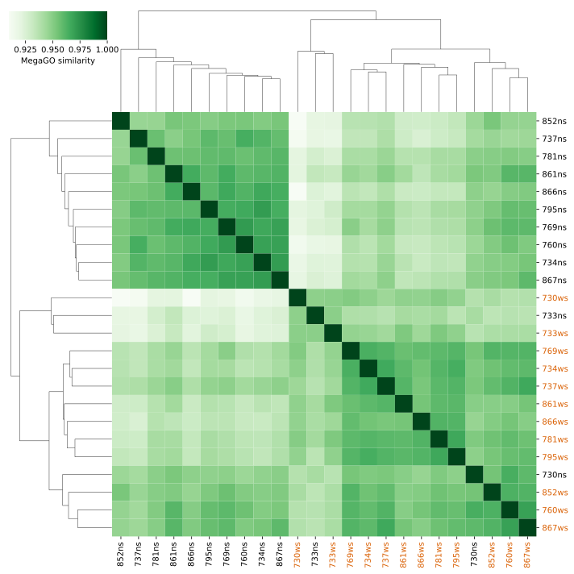
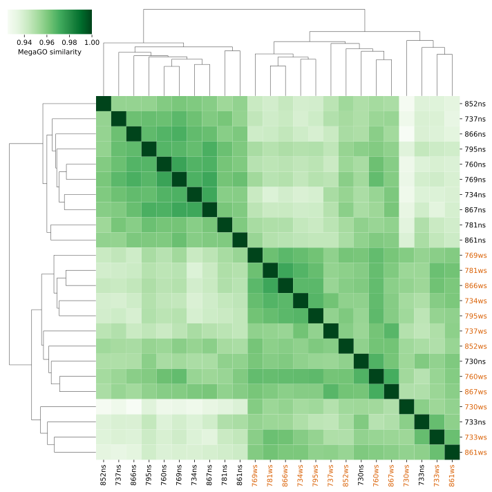

Input data is from [here](https://zenodo.org/record/2652530)

Install environment: `conda env create --file environment.yaml`
Activate environment: `conda activate snakemake`
Run analysis: `snakemake --forceall --cores`

# Results
csv-tables containing the similarities between all samples are in the `workflows/{comparison}/aggregated_sim` folder.

Conducted comparisons are:
- [megago based on real-world data](workflows/megago_comparison/)
- [string based comparison on real-world data](workflows/string_based_comparison/)
- [megago based on random sets of go terms of various sizes](workflows/random_gos_comparison/)

## molecular function

## biological process

## cellular component

